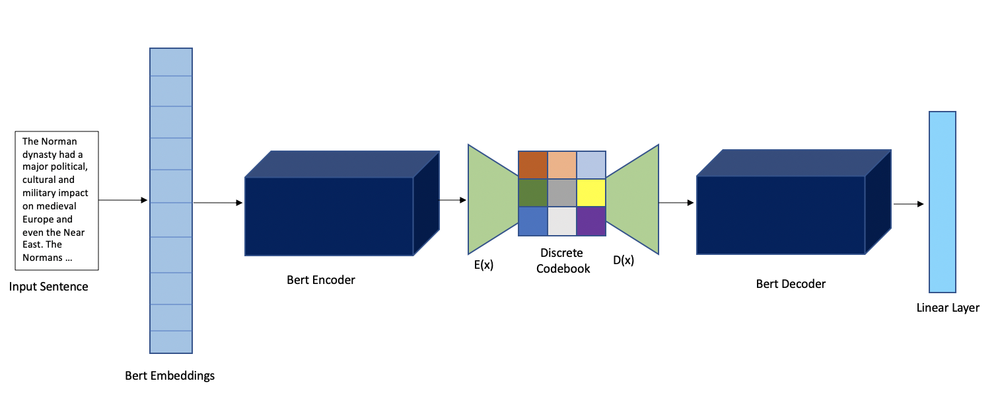
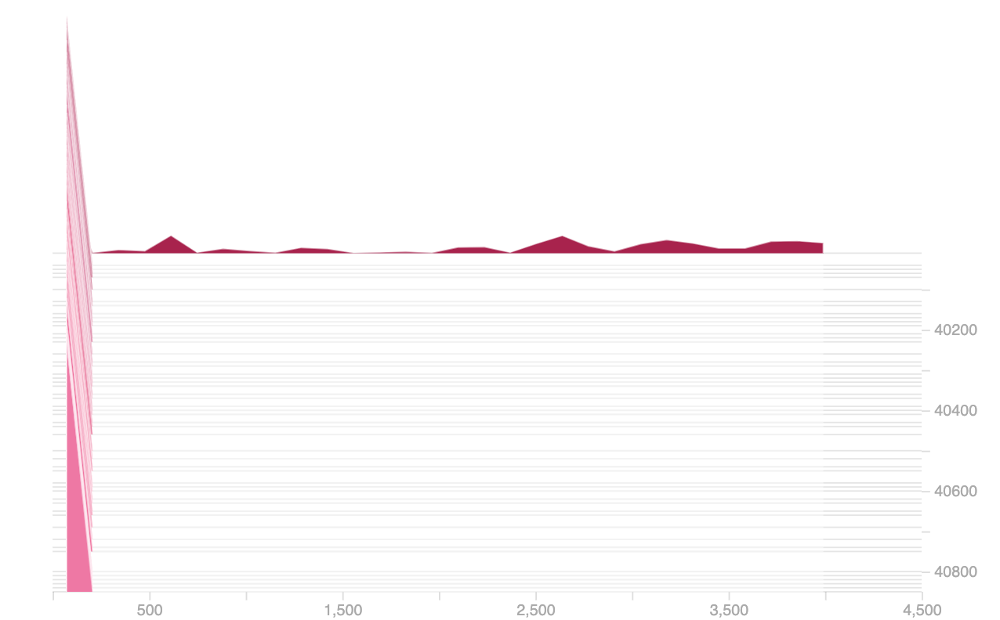
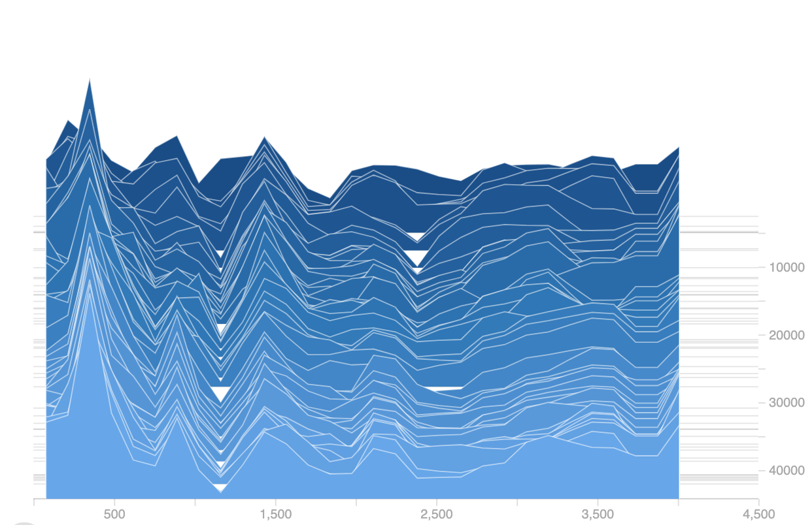

# BrainQA
Cognitively inspired architecture for QA neural network with a "concept" bottleneck. Created in conjunction with @joepace. 

## Background 
Deep inside the mammalian cortex is a small, sea-horse shaped structure called the "hippocampus". In the 1950's and onward,
a series of incredible discoveries demonstrated the critical role that the hippocampus plays in tasks such as navigation 
and memory. One of the most interesting properties of this brain region is the unique neural firing pattern of cells 
known as "place cells" - neurons that fire at specific locations in an environment. 

Inspired by computational models that demonstrate how this neural activity can be recreated by clustering algorithms,
we seek to adapt these ideas for the purpose of improving natural language processing tasks. Specifically, current models
have limited memory capacities, and have a difficult time processing very long text documents, such as books. 
Here we test a proof-of-concept for this idea, adding a "concept-bottleneck" to a Question-Answering model to see if 
explicitly extracting latent "concepts" improves performance. 

A diagram of our model is pictured here:

We pass reconstructed encoder outputs from a pre-trained BERT model into a VQ-VAE model, which forms clusters of 
semantically related concepts. We then pass those reconstructions into a BERT Decoder, which outputs to a linear layer
from which we can collect start and end logits for question-answer spans.

Our model addresses issues in VQ-VAE such as index collapse:

**Vanilla VQ-VAE:**

**Random Restart:**

However, we find that all in all, the model performs significantly worse than baseline. 

## Data
Data used for this model comes from SQuAD2.0. You can download the training and development set here:
https://rajpurkar.github.io/SQuAD-explorer/

## Dependencies
Python 3.*

PyTorch v1.4.0

Variety of other usual suspects:

Matplotlib, numpy, etc...

## Usage

### Training:
To train the model, clone the repository and run `./execute.sh desired_output_directory`. To run the model in the background 
simply provide an additional argument to indicate a file to log progress to: 

`./execute.sh desired_output_directory log_file.out`. 

### Testing:
You can evaluate performance on the development data by running `./evaluate.sh path_to_output_directory`. If you have multiple checkpoints saved this will evaluate all of them. You can evaluate just the last one by removing the 

`--eval_all_checkpoints` 

flag in the `evaluate.sh` script.

### Visualization
If you want to visualize the VQ-VAE reconstructions of BERT encoder outputs, simply run `./visualize.sh path_to_output_directory`. This code is the least developed/general purpose, so you may need to tweak some things to get it working for your use case.

